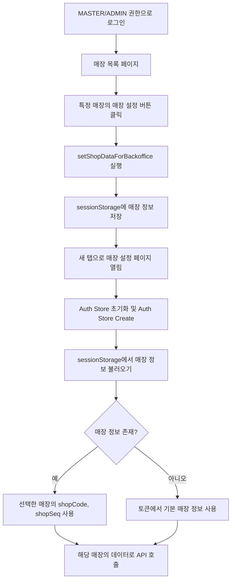
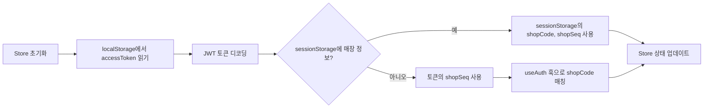
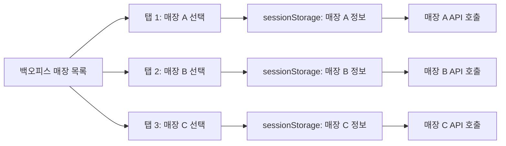

# 백오피스 매장 접근 기능

백오피스에서 관리자로 로그인 했을 때, 여러 매장의 설정을 관리하기 위해 특정 매장을 선택하고 접근하는 기능 정리.

## 개요

| 구분                | 설명                                                                                           |
| ------------------- | ---------------------------------------------------------------------------------------------- |
| **권한 체계**       | SHOP (일반 매장), ADMIN (백오피스 관리자), MASTER (최고 관리자)                                |
| **접근 방식**       | 매장 목록에서 매장 선택 → sessionStorage에 저장 → 새 탭으로 해당 매장 관리 페이지 열기         |
| **저장 위치**       | sessionStorage (탭마다 독립적으로 관리)                                                        |
| **동시 관리**       | 새 탭으로 열리므로 여러 매장을 동시에 관리 가능                                                |
| **접근 제한**       | SHOP 권한은 백오피스 접근 불가, 회원 관리 탭은 MASTER만 가능                                       |

---

## 권한 체계

### 권한별 접근 범위

| 권한      | 백오피스 접근 | 매장 목록 | 매장 관리 | 공지사항 관리 | 앱 이력 관리 | 회원 관리 |
| --------- | ------------- | --------- | --------- | ------------- | ------------ | --------- |
| **SHOP**   | ❌            | ❌        | ✅ (본인)  | ❌            | ❌           | ❌        |
| **ADMIN**  | ✅            | ✅        | ✅ (전체)  | ✅            | ✅           | ❌        |
| **MASTER** | ✅            | ✅        | ✅ (전체)  | ✅            | ✅           | ✅        |

### 권한 체크 로직

```typescript
// requireBackofficeLoader: SHOP 역할 차단
const requireBackofficeLoader = () => {
  const payload = getTokenPayload();
  
  if (payload.role === 'SHOP') {
    return redirect(ROUTES.NOT_FOUND.generate());
  }
  
  return null; // ADMIN, MASTER만 통과
};

// requireMasterLoader: MASTER 역할만 허용
const requireMasterLoader = () => {
  const payload = getTokenPayload();
  
  if (payload.role !== 'MASTER') {
    return redirect(ROUTES.NOT_FOUND.generate());
  }
  
  return null;
};
```

---

## 매장 접근 플로우



---

## 매장 선택 및 저장

### 매장 목록 페이지 (StoresPage)

**파일**: `pages/backoffice/StoresPage/Table/index.tsx`

```typescript
const redirectToStoreDetail = (shopCode: string, shopSeq: number) => {
  // 1. sessionStorage에 선택한 매장 정보 저장
  useAuthStore.getState().setShopDataForBackoffice(shopCode, shopSeq);
  
  // 2. 새 탭으로 해당 매장의 설정 페이지 열기
  const url = `${window.location.origin}${ROUTES.SETTINGS.NOTICES.generate()}`;
  window.open(url, '_blank');
};
```

**동작 순서**:
1. 매장 목록에서 "매장 설정" 버튼 클릭
2. `setShopDataForBackoffice(shopCode, shopSeq)` 호출
3. 선택한 매장 정보를 sessionStorage에 저장
4. 새 탭으로 해당 매장의 관리 페이지 열기

### Store에 매장 정보 저장

**파일**: `stores/useAuthStore.ts`

```typescript
setShopDataForBackoffice: (shopCode: string, shopSeq: number) => {
  // sessionStorage에 저장 (탭마다 독립적)
  storage.session.save<string>(STORAGE_KEYS.SHOP_CODE, shopCode);
  storage.session.save<number>(STORAGE_KEYS.SHOP_SEQ, shopSeq);
  
  // Store 상태도 업데이트
  set({ shopCode, shopSeq });
}
```

**저장 위치**: sessionStorage
- `SHOP_CODE`: 선택한 매장 코드 (문자열)
- `SHOP_SEQ`: 선택한 매장 시퀀스 (숫자)

**sessionStorage를 사용하는 이유**:
- 각 탭이 독립적인 sessionStorage를 가짐
- 여러 매장을 동시에 다른 탭에서 관리 가능
- 탭을 닫으면 자동으로 정보 삭제 (localStorage보다 안전)

---

## 새 탭에서 매장 정보 불러오기

### Store 초기화 시 우선순위



### 매장 정보 불러오기 로직

```typescript
const initializeAuth = (): {
  tokenPayload: ITokenPayload | null;
  shopCode: string | null;
  shopSeq: number | null;
} => {
  const accessToken = getAccessToken();
  if (!accessToken) {
    return { tokenPayload: null, shopCode: null, shopSeq: null };
  }

  const payload = decodeJwtToken<ITokenPayload>(accessToken);
  
  // sessionStorage에서 백오피스에서 선택한 매장 정보 확인
  const sessionShopCode = storage.session.load<string>(STORAGE_KEYS.SHOP_CODE);
  const sessionShopSeq = storage.session.load<number>(STORAGE_KEYS.SHOP_SEQ);

  // sessionStorage에 값이 있으면 우선 사용 (백오피스 모드)
  if (sessionShopCode && sessionShopSeq !== null) {
    return {
      tokenPayload: payload,
      shopCode: sessionShopCode,
      shopSeq: sessionShopSeq,
    };
  }

  // sessionStorage에 값이 없으면 토큰에서 가져옴 (일반 모드)
  const shopSeq = payload.shopSeq;
  return { tokenPayload: payload, shopCode: null, shopSeq };
};
```

**우선순위**:
1. **sessionStorage** (백오피스에서 매장 선택한 경우)
2. **JWT 토큰** (일반 로그인한 경우)

---

## 라우터 권한 체크

### 백오피스 라우트 설정

**파일**: `router.tsx`

```typescript
const createBackofficeRoutes = () => [
  // 매장 목록 (ADMIN, MASTER)
  {
    path: ROUTES.BACKOFFICE.STORES.path,
    loader: requireBackofficeLoader,  // SHOP 차단
    element: createRoute(StoresPage),
  },
  
  // 회원 관리 (MASTER만)
  {
    path: ROUTES.BACKOFFICE.MEMBERS.path,
    loader: requireMasterLoader,      // MASTER만 허용
    element: createRoute(MembersPage),
  },
  
  // 공지사항 관리 (ADMIN, MASTER)
  {
    path: ROUTES.BACKOFFICE.NOTICES.path,
    loader: requireBackofficeLoader,
    element: createRoute(AdminNoticesPage),
  },
  
  // 앱 이력 관리 (ADMIN, MASTER)
  {
    path: ROUTES.BACKOFFICE.APP_HISTORIES.path,
    loader: requireBackofficeLoader,
    element: createRoute(AppHistoriesPage),
  },
];
```

### 로그인 후 리디렉션

```typescript
const redirectByUserRole = (payload: ITokenPayload) => {
  const isNative = CapacitorApp.isNative();
  
  // SHOP 권한
  if (payload.role === 'SHOP') {
    if (isNative) {
      return redirect(ROUTES.TABLES.generate());
    }
    return redirect(ROUTES.SETTINGS.NOTICES.generate());
  }

  // ADMIN, MASTER 권한 && Web
  if (!isNative) {
    return redirect(ROUTES.BACKOFFICE.STORES.generate());
  }

  // 권한 없음
  return redirect(ROUTES.NOT_FOUND.generate());
};
```

---

## 매장별 독립 관리

### 새 탭으로 여러 매장 동시 관리



**장점**:
- 각 탭이 독립적인 sessionStorage를 가짐
- 여러 매장을 동시에 관리 가능
- 탭을 닫으면 자동으로 세션 정리

---

## 사용 시나리오

### 시나리오 1: 백오피스 관리자가 매장 A 관리

```
1. ADMIN 권한으로 로그인
   ↓
2. /backoffice/stores 접속
   ↓
3. 매장 A의 "매장 설정" 버튼 클릭
   ↓
4. sessionStorage에 매장 A 정보 저장
   ↓
5. 새 탭: /settings/notices
   ↓
6. Store 초기화: sessionStorage에서 매장 A 정보 불러옴
   ↓
7. 매장 A의 매장 설정 관리 
```

### 시나리오 2: 여러 매장 동시 관리

```
1. 백오피스 매장 목록에서 매장 A 선택 → 탭 1 열림
2. 백오피스 매장 목록에서 매장 B 선택 → 탭 2 열림
3. 백오피스 매장 목록에서 매장 C 선택 → 탭 3 열림

탭 1: 매장 A 설정
탭 2: 매장 B 설정
탭 3: 매장 C 설정

각 탭은 독립적으로 동작
```

### 시나리오 3: 일반 매장 관리자 로그인

```
1. SHOP 권한으로 로그인
   ↓
2. /settings/notices 바로 접속
   ↓
3. 본인 매장만 관리 가능
```

---

## 권한별 접근 경로

### SHOP (일반 매장 관리자)

```typescript
// 로그인 시 리디렉션
if (payload.role === 'SHOP') {
  // 네이티브 앱: 테이블 페이지
  if (isNative) {
    return redirect(ROUTES.TABLES.generate());
  }
  // 웹: 공지사항 페이지
  return redirect(ROUTES.SETTINGS.NOTICES.generate());
}
```

- ✅ 본인 매장 설정 페이지 접근 가능
- ❌ 백오피스 페이지 접근 불가

### ADMIN (백오피스 관리자)

```typescript
// 로그인 시 리디렉션
if (!isNative) {
  return redirect(ROUTES.BACKOFFICE.STORES.generate());
}
```

- ✅ 매장 목록, 매장 관리, 공지사항, 앱 이력 접근 가능
- ❌ 회원 관리 접근 불가

### MASTER (최고 관리자)

```typescript
// 모든 백오피스 기능 접근 가능
const isMaster = tokenPayload?.role === 'MASTER';

if (isMaster) {
  menuItems.push({
    title: '회원 관리',
    path: ROUTES.BACKOFFICE.MEMBERS.generate(),
  });
}
```

- ✅ 모든 백오피스 기능 접근 가능
- ✅ 회원 관리 추가 접근 가능

---

## 관련 파일

| 역할                          | 파일                                                |
| ----------------------------- | --------------------------------------------------- |
| 매장 목록 페이지              | `pages/backoffice/StoresPage/index.tsx`            |
| 매장 선택 테이블              | `pages/backoffice/StoresPage/Table/index.tsx`      |
| 인증 Store                    | `stores/useAuthStore.ts`                            |
| 라우터 (권한 체크)            | `router.tsx`                                        |
| 백오피스 사이드바             | `feature/Backoffice/SidebarLayout/index.tsx`       |
| 라우팅 상수                   | `constants/routes.ts`                               |
| Storage 키 상수               | `constants/keys.ts`                                 |
| 회원 관리 페이지              | `pages/backoffice/MembersPage/index.tsx`           |
| 공지사항 관리 페이지          | `pages/backoffice/NoticesPage/index.tsx`           |
| 앱 이력 관리 페이지           | `pages/backoffice/AppHistoriesPage/index.tsx`      |

---

## 요약

### 권한 체계
- **SHOP**: 일반 매장 관리자, 본인 매장만 관리, 백오피스 접근 불가
- **ADMIN**: 백오피스 관리자, 모든 매장 관리 가능, 회원 관리 불가
- **MASTER**: 최고 관리자, 모든 기능 접근 가능

### 매장 접근 방식
1. 백오피스 매장 목록에서 매장 선택
2. sessionStorage에 선택한 매장 정보 저장
3. 새 탭으로 해당 매장 관리 페이지 열기
4. 각 탭은 독립적으로 매장 관리

### 핵심 개념
- **sessionStorage 사용**: 탭마다 독립적인 매장 정보 관리
- **우선순위**: sessionStorage → JWT 토큰
- **동시 관리**: 여러 탭으로 여러 매장 동시 관리 가능
- **권한 체크**: router loader에서 권한별 접근 제어
