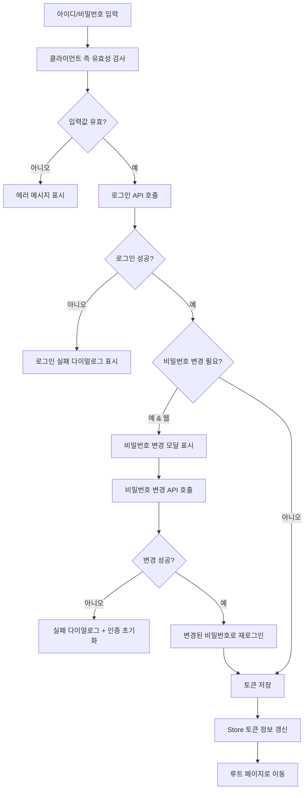
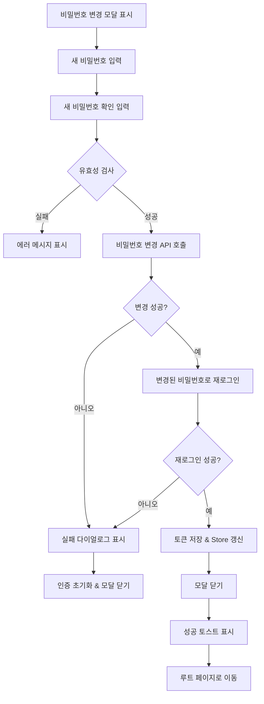
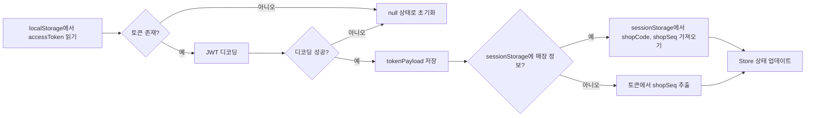
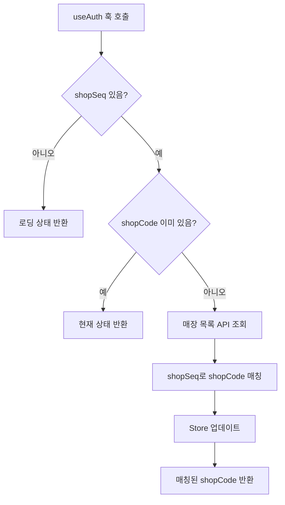

# 로그인 기능

관리자 앱의 로그인 방식과 인증 토큰 관리, 비밀번호 변경 요구 처리 흐름 정리.

## 개요

| 구분                    | 설명                                                                                                                           |
| ----------------------- | ------------------------------------------------------------------------------------------------------------------------------ |
| **로그인 타입**         | 일반 로그인 (아이디/비밀번호)                                                                                                  |
| **인증 방식**           | JWT 토큰 기반 (AccessToken + RefreshToken)                                                                                     |
| **비밀번호 변경 요구**  | 서버에서 `isPasswordChangeRequired: true` 응답 시, 웹에서만 비밀번호 변경 모달 표시 (네이티브 앱에서는 처리하지 않음)          |
| **토큰 저장**           | `setAccessToken`, `setRefreshToken`으로 localStorage에 저장                                                                    |
| **Store 업데이트**      | 로그인 성공 시 `useAuthStore.refreshTokenInfo()` 호출하여 토큰 디코딩 및 상태 갱신                                             |
| **SSE 연결**            | `App.tsx`의 `useSSEHandler`에서 자동으로 처리됨 (로그인 직후 별도 호출 불필요)                                                 |

---

## 로그인 플로우



---

## 로그인 처리 상세

### 1단계: 클라이언트 측 유효성 검사

```typescript
// 아이디/비밀번호 trim 후 검사
if (!trimmedId) {
  setIdErrorMessage(t('아이디를 입력해주세요.'));
  return;
}
if (!trimmedPassword) {
  setPasswordErrorMessage(t('비밀번호를 입력해주세요.'));
  return;
}
```

### 2단계: 로그인 API 호출

```typescript
const response = await login({
  id: trimmedId,
  pw: trimmedPassword,
});
```

- **API Hook**: `usePostLogin` (`@repo/api/queries`)
- **요청 파라미터**: `{ id: string, pw: string }`
- **응답**:
  - `data.loginResult`: 로그인 성공 여부
  - `data.accessToken`: JWT Access Token
  - `data.refreshToken`: JWT Refresh Token
  - `data.isPasswordChangeRequired`: 비밀번호 변경 필요 여부

### 3단계: 로그인 결과 처리

#### 로그인 실패 (`loginResult: false`)

```typescript
if (!response.data.loginResult) {
  openConfirmDialog({
    title: t('로그인 실패'),
    content: response.status.userMessage,
  });
  return;
}
```

#### 비밀번호 변경 필요 (`isPasswordChangeRequired: true` & 웹)

```typescript
if (response.data.isPasswordChangeRequired && !CapacitorApp.isNative()) {
  // 임시로 accessToken 저장 (비밀번호 변경 API 호출용)
  tempAccessToken.current = response.data.accessToken;
  useAuthStore.getState().refreshTokenInfo();
  toast('비밀번호를 변경해주세요.');
  setLoginUserId(trimmedId);
  setLoginUserPassword(trimmedPassword);
  setIsPasswordChangeModalOpen(true);
  return;
}
```

- **네이티브 앱**에서는 비밀번호 변경 모달을 표시하지 않음
- **웹**에서만 `LoginPasswordChangeModal` 표시

#### 로그인 성공 (일반)

```typescript
// 토큰 저장
setAccessToken(response.data.accessToken);
setRefreshToken(response.data.refreshToken);

// Store 업데이트 (토큰 디코딩, shopSeq 추출)
useAuthStore.getState().refreshTokenInfo();

// 루트 경로로 이동 (router에서 자동 리디렉트됨)
navigate(ROUTES.ROOT.generate());
```

---

## 비밀번호 변경 플로우



### 비밀번호 변경 유효성 검사

`validateNewPassword` 함수를 사용하여 다음을 검사:
- 비밀번호 길이, 복잡도 등 (구체적인 규칙은 `@repo/util/string` 참조)
- 이전 비밀번호와 동일한지 확인
- 새 비밀번호와 확인 비밀번호 일치 여부

### 비밀번호 변경 API 호출

```typescript
await rawApi({
  method: 'PUT',
  url: '/member/password',
  headers: {
    Authorization: `Bearer ${tempAccessToken.current}`,
  },
  data: {
    memberId: loginUserId,
    memberPassword: newPassword,
    existingMemberPassword: loginUserPassword,
  },
});
```

#### rawApi를 사용하는 이유

**왜 privateApi가 아닌 rawApi를 사용할까?**

| API 종류        | 인증 헤더 처리                          | 토큰 위치        | 
| --------------- | --------------------------------------- | ---------------- |
| **privateApi**  | 자동 추가 (localStorage에서 읽기)       | localStorage     |
| **rawApi**      | 수동 추가 (개발자가 직접 헤더 설정)    | 원하는 곳 어디든 |

**현재 상황**:
- 비밀번호 변경 필요 시점에는 localStorage에 토큰이 저장되지 않음
- `tempAccessToken.current`에만 임시로 저장됨
- privateApi는 자동으로 localStorage에서 토큰을 읽어 헤더에 추가하므로 사용 불가

**해결**:
- rawApi는 interceptor가 없어서 개발자가 직접 헤더를 제어할 수 있음
- `tempAccessToken.current`를 수동으로 헤더에 추가하여 인증 처리

```typescript
// ❌ privateApi 사용 시
await privateApi.put('/member/password', { ... });
// → localStorage에서 토큰을 못 찾음 → 401 Unauthorized 에러

// ✅ rawApi 사용 시
await rawApi({
  headers: { Authorization: `Bearer ${tempAccessToken.current}` },
  ...
});
// → ref에 저장된 임시 토큰으로 인증 성공
```

- **임시 토큰 사용**: `tempAccessToken.current` (로그인 시 받은 accessToken)
- **실패 시**: 에러 다이얼로그 표시 → 인증 초기화 (`clearAuth()`) → 모달 닫기

### 비밀번호 변경 후 재로그인

```typescript
const response = await login({
  id: loginUserId,
  pw: newPassword,
});

if (!response.data.loginResult) {
  // 재로그인 실패 처리
  openConfirmDialog({
    title: t('로그인 실패'),
    content: response.status.userMessage,
  });
  clearAuth();
  setIsPasswordChangeModalOpen(false);
  return;
}

// 재로그인 성공 처리
setAccessToken(response.data.accessToken);
setRefreshToken(response.data.refreshToken);
useAuthStore.getState().refreshTokenInfo();
setIsPasswordChangeModalOpen(false);
toast('비밀번호가 변경되었습니다.');
navigate(ROUTES.ROOT.generate());
```

---

## 인증 Store (useAuthStore)

### 개요

**역할**: 로그인 후 토큰 정보를 저장하고 관리하는 전역 상태 저장소

| 저장 항목          | 설명                                                      |
| ------------------ | --------------------------------------------------------- |
| `tokenPayload`     | JWT 토큰 디코딩 결과 (memberId, shopSeq 등 포함)          |
| `shopSeq`          | 매장 시퀀스 번호 (숫자) - 토큰에서 추출                    |
| `shopCode`         | 매장 코드 (문자열) - API 호출 시 필요, 별도 매칭 필요      |
| `refreshTokenInfo` | localStorage에서 토큰을 읽어 디코딩하고 상태 갱신          |
| `clearAuth`        | 로그아웃 시 모든 인증 정보 초기화                          |

### 상태 관리

```typescript
interface IAuthStore {
  tokenPayload: ITokenPayload | null;  // 디코딩된 토큰 페이로드
  shopCode: string | null;              // 매장 코드 (문자열)
  shopSeq: number | null;               // 매장 시퀀스 (숫자)
  refreshTokenInfo: () => void;         // 토큰 정보 갱신
  clearAuth: () => void;                // 인증 초기화
  setShopDataForBackoffice: (shopCode: string, shopSeq: number) => void; // 백오피스 매장 설정
}
```

### shopSeq 가져오기

`refreshTokenInfo()` 호출 시, **두 가지 경로**로 shopSeq를 가져옵니다:

```typescript
const sessionShopSeq = storage.session.load<number>(STORAGE_KEYS.SHOP_SEQ);

set({
  tokenPayload: payload,
  shopSeq: payload.shopSeq || sessionShopSeq,  // 우선순위: 토큰 → sessionStorage
});
```

| 우선순위 | 경로               | 설명                                                      |
| -------- | ------------------ | --------------------------------------------------------- |
| **1번**  | `payload.shopSeq`  | JWT 토큰에 포함된 shopSeq (일반 매장 관리자 로그인)       |
| **2번**  | `sessionShopSeq`   | sessionStorage에 저장된 shopSeq (백오피스 관리자 매장 선택)|

### 토큰 정보 초기화 및 갱신



- **백오피스 모드**: sessionStorage에 `SHOP_CODE`, `SHOP_SEQ` 저장되어 있으면 우선 사용
- **일반 모드**: 토큰에서 `shopSeq` 추출, `shopCode`는 `useAuth` 훅에서 매칭

### 인증 초기화 (`clearAuth`)

```typescript
clearAuth: () => {
  removeAuthTokens();                                    // localStorage에서 토큰 제거
  storage.session.remove(STORAGE_KEYS.SHOP_CODE);        // sessionStorage 정리
  storage.session.remove(STORAGE_KEYS.SHOP_SEQ);
  set({ tokenPayload: null, shopCode: null, shopSeq: null }); // Store 초기화
}
```

---

## 인증 훅 (useAuth)

### 개요

**역할**: shopSeq로 매장목록에서 해당 매장의 shopCode를 찾는 용도의 훅

**왜 필요한가?**
- JWT 토큰에는 `shopSeq`만 들어있고 `shopCode`는 없음
- 하지만 많은 API 호출 시 `shopCode`가 필요함
- 따라서 매장 목록을 조회해서 `shopSeq`로 `shopCode`를 찾아야 함

```typescript
// JWT 토큰 payload 예시
{
  shopSeq: 123,      // ✅ 토큰에 포함됨
  // shopCode는 없음 ❌
  memberId: "admin",
  ...
}
```

### useAuthStore vs useAuth 비교

| 구분             | useAuthStore                               | useAuth                                    |
| ---------------- | ------------------------------------------ | ------------------------------------------ |
| **타입**         | Zustand Store (전역 상태)                  | React Hook (컴포넌트용)                    |
| **역할**         | 토큰 정보 저장 및 관리                     | shopSeq로 shopCode를 조회해옴                    |
| **포함 데이터**  | tokenPayload, shopSeq, shopCode            | shopCode, shopSeq, tokenPayload, isLoading |
| **API 호출**     | 없음                                       | useGetShops (매장 목록 조회)               |
| **사용 시점**    | 로그인 성공 시 토큰 저장                   | 컴포넌트에서 shopCode 필요 시              |

### 동작 흐름



### 코드 설명

```typescript
// 1. shopSeq는 있지만 shopCode가 없을 때만 API 호출
const { data: shopsResponse } = useGetShops({
  enabled: !!shopSeq && !shopCode,
});

// 2. 매장 목록에서 shopSeq로 shopCode 매칭
const matchedShopCode = useMemo(() => {
  if (!shopSeq || shops.length === 0) {
    return null;
  }
  const shop = shops.find((s) => s.shopSeq === shopSeq);
  return shop?.shopCode ?? null;
}, [shopSeq, shops]);

// 3. 찾은 shopCode를 Store에 자동 업데이트
useEffect(() => {
  if (matchedShopCode && matchedShopCode !== shopCode) {
    useAuthStore.setState({ shopCode: matchedShopCode });
  }
}, [matchedShopCode, shopCode]);
```

### 사용 예시

```typescript
function SomeComponent() {
  const { shopCode, shopSeq } = useAuth(); // 자동으로 shopCode 매칭됨
  
  // shopCode를 사용해서 API 호출
  const { data } = useGetMenuList({ shopCode }); 
  
  return <div>매장 코드: {shopCode}</div>;
}
```

---

## UI 컴포넌트

### LoginPage

- **파일**: `pages/LoginPage/index.tsx`
- **주요 상태**:
  - `id`, `password`: 입력값
  - `idErrorMessage`, `passwordErrorMessage`: 에러 메시지
  - `passwordInputType`: 비밀번호 표시/숨김 (`'password'` | `'text'`)
  - `isPasswordChangeModalOpen`: 비밀번호 변경 모달 표시 여부
  - `loginUserId`, `loginUserPassword`: 비밀번호 변경용 임시 저장
  - `tempAccessToken`: 비밀번호 변경 API 호출용 임시 토큰
- **주요 함수**:
  - `handleIdChange`: 아이디 입력 시 실시간 유효성 검사
  - `handlePasswordChange`: 비밀번호 입력 시 실시간 유효성 검사
  - `handleLogin`: 로그인 처리
  - `handlePasswordChangeSubmit`: 비밀번호 변경 처리

### LoginPasswordChangeModal

- **파일**: `pages/LoginPage/LoginPasswordChangeModal/index.tsx`
- **Props**:
  - `isOpen`: 모달 표시 여부
  - `onConfirm`: 비밀번호 변경 확인 콜백 (`(newPassword: string) => Promise<void>`)
  - `existingPassword`: 기존 비밀번호 (유효성 검사용)
- **주요 상태**:
  - `newPassword`, `confirmPassword`: 새 비밀번호 입력값
  - `newPasswordVisible`, `confirmPasswordVisible`: 비밀번호 표시/숨김
  - `newPasswordError`, `confirmPasswordError`: 에러 메시지
- **유효성 검사**:
  - 새 비밀번호 복잡도 검사 (`validateNewPassword`)
  - 기존 비밀번호와 동일한지 확인
  - 새 비밀번호와 확인 비밀번호 일치 여부

---

## SSE 연결

- **처리 위치**: `App.tsx`의 `useSSEHandler`
- **자동 연결**: 로그인 후 토큰이 있으면 자동으로 SSE 연결 시작
- **로그인 직후**: 별도로 SSE 연결 함수를 호출할 필요 없음

---

## 관련 파일

| 역할                    | 파일                                                                   |
| ----------------------- | ---------------------------------------------------------------------- |
| 로그인 페이지           | `pages/LoginPage/index.tsx`                                            |
| 비밀번호 변경 모달      | `pages/LoginPage/LoginPasswordChangeModal/index.tsx`                   |
| 인증 Store              | `stores/useAuthStore.ts`                                               |
| 인증 훅                 | `hooks/useAuth.ts`                                                     |
| 로그인 API              | `@repo/api/queries` (usePostLogin)                                     |
| 비밀번호 변경 API       | `rawApi` (`/member/password`)                                          |
| 토큰 관리               | `@repo/api/auth` (setAccessToken, setRefreshToken, removeAuthTokens)  |
| 토큰 디코딩             | `@repo/util/function` (decodeJwtToken)                                 |
| 비밀번호 유효성 검사    | `@repo/util/string` (validateNewPassword)                              |
| 라우팅 상수             | `constants/routes.ts`                                                  |

---

## 요약

### 로그인 흐름
아이디/비밀번호 입력 → API 호출 → 성공 시 토큰 저장 및 Store 갱신 → 루트 페이지 이동

### 비밀번호 변경 요구
웹에서만 모달 표시 → 변경 후 재로그인 → 토큰 저장 및 페이지 이동

### 인증 관리
- **useAuthStore (Store)**: 로그인 후 토큰 정보를 저장하고 관리하는 전역 상태
  - tokenPayload 디코딩, shopSeq 추출
  - sessionStorage 우선 사용 (백오피스 모드)
  
- **useAuth (Hook)**: shopSeq를 shopCode로 변환하는 헬퍼 훅
  - 매장 목록 API 조회 후 shopSeq로 shopCode 매칭
  - 자동으로 Store 업데이트
  - 컴포넌트에서 shopCode 필요 시 사용

### 핵심 개념
- **JWT 토큰에는 shopSeq(숫자)만 포함**, shopCode(문자열)는 없음
- **API 호출 시 shopCode 필요** → useAuth 훅이 자동으로 변환
- **SSE**: App.tsx에서 자동 처리, 로그인 직후 별도 호출 불필요
