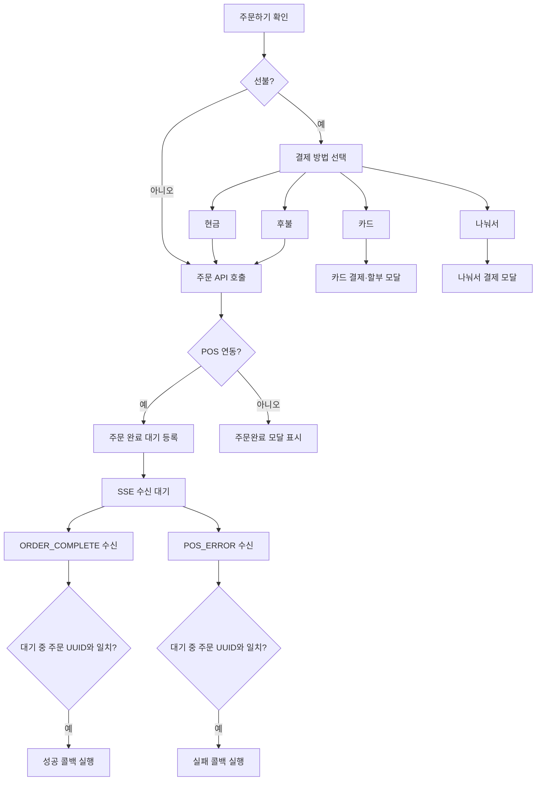
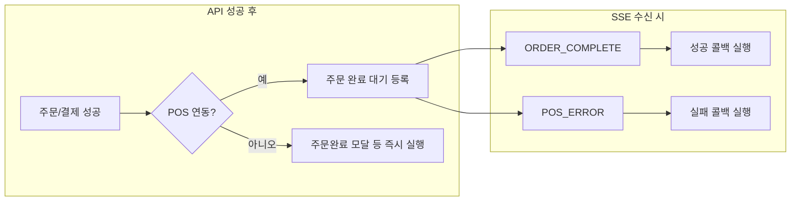
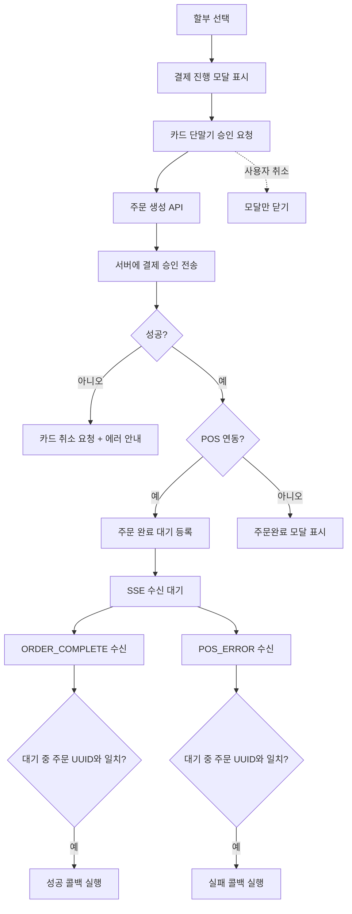
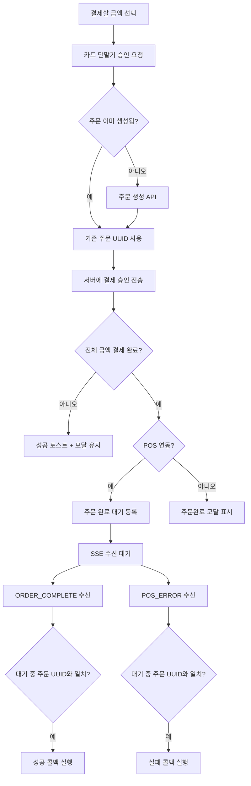

# 결제 기능

메뉴 앱 결제 방식과 POS 연동 시 주문 완료 처리(ORDER_COMPLETE / POS_ERROR) 흐름 정리.

## 개요

| 구분               | 설명                                                                                                                |
| ------------------ | ------------------------------------------------------------------------------------------------------------------- |
| **결제 종류**      | 카드(단일), 나눠서(카드 분할), 현금, 후불                                                                           |
| **결제 방법 노출** | 매장 설정에 따름: 현금 `usePrepaymentCashPayment`, 나눠서 `usePrepaymentDutch`, 후불 `usePrepaymentDeferredPayment` |
| **POS 연동**       | `shopPosCode` 존재·`'NONE'` 아님 → ORDER_COMPLETE/POS_ERROR SSE 대기 후 콜백                                        |

---

## 결제 진입 흐름

---

## POS 연동 완료 처리

- **연동 시**: `setPendingOrder(orderGroupUuid, onSuccess, onFailure)` 등록 → UUID 일치하는 SSE 시 콜백 실행.
- **미연동 시**: 성공 콜백 즉시 실행(주문완료 모달 등).
- **판단**: `isPosLinked = !!shopPosCode && shopPosCode !== 'NONE'`

---

## 브릿지 (Payment, @repo/util/app)

| 메서드      | 용도                                                             |
| ----------- | ---------------------------------------------------------------- |
| **approve** | 카드 승인(D1). 실패 시 `Payment.cancel` 호출하여 환불 처리.      |
| **cancel**  | 카드 취소(D4). `postPaymentApproval` 실패 시 사용하여 환불 처리. |
| **stop**    | 결제 중단. 모달 cleanup 시 호출.                                 |

할부: `formatInstallmentMonthsToString` → `"00"`(일시불), `"02"`~`"24"`, `"36"`/`"48"`/`"60"`. 5만 원 미만은 일시불.

---

## 카드 결제 (단일)

**파일**: `CardPaymentInstallmentModal/index.tsx`

- 에러: 사용자 취소 → 모달만 닫기. 그 외 → 다이얼로그. POS_ERROR → 실패 콜백.

---

## 나눠서 결제

**파일**: `SplitPaymentModal/index.tsx` · 메뉴별/인원별 나누기, 첫 결제 시에만 `createOrder` 후 동일 주문으로 `postPaymentApproval` 반복.

---

## 기타 SSE와 결제

- **ORDER 메시지(handleOrderMessage)**: 주문 데이터 갱신 후, 결제 관련 모달(현금 유도 / 나눠서 / 카드 할부)이 열려 있고, 해당 테이블이 **전액 결제 완료**(totalAmount - paidAmount === 0)이면 `closeAllModals()` 호출. 다른 경로(예: 관리자 측 정산)로 전액 결제된 경우에도 모달이 자동으로 닫힘.

---

## 관련 파일

| 역할                | 파일                                                                                                              |
| ------------------- | ----------------------------------------------------------------------------------------------------------------- |
| 장바구니·주문 확인  | `CartButton/index.tsx` (executePostpaidOrder, 모달 열기), `CartList/index.tsx` (주문하기 확인, openPaymentsModal) |
| 결제 방법 선택      | `PaymentsModal/index.tsx`                                                                                         |
| 카드(단일) / 나눠서 | `CardPaymentInstallmentModal`, `SplitPaymentModal`                                                                |
| 브릿지·API          | `@repo/util/app` Payment, `usePostPaymentApproval`                                                                |
