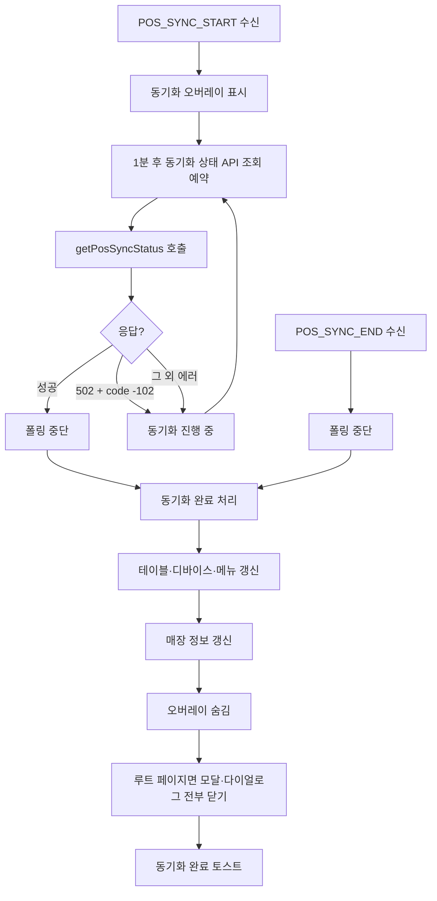

# POS 동기화 (POS_SYNC_START / POS_SYNC_END)

서버에서 POS(포스)와 데이터 동기화가 시작·종료될 때 SSE로 알리고, 메뉴 앱은 그에 맞춰 안내 오버레이를 노출 및 데이터를 갱신하는 기능입니다.

## 개요

| 구분               | 설명                                                                                                                                            |
| ------------------ | ----------------------------------------------------------------------------------------------------------------------------------------------- |
| **목적**           | POS와 서버 간 동기화가 진행되는 동안 사용자에게 "동기화 중" 상태를 보여 주고, 동기화가 끝나면 테이블·메뉴·매장 정보를 갱신한 뒤 오버레이를 닫음 |
| **트리거**         | 서버가 SSE로 `POS_SYNC_START`(동기화 시작), `POS_SYNC_END`(동기화 종료) 전송                                                                    |
| **동기화 중 UI**   | 전체 화면 오버레이("최신 데이터를 불러오는 중", `PosSyncOverlayModal`)                                                                          |
| **동기화 완료 시** | 테이블·디바이스·메뉴·매장 정보 갱신, 오버레이 숨김, 루트(/)일 때 모달/다이얼로그 전부 닫기, "동기화가 완료되었습니다." 토스트                   |

POS 연동 매장(`shopPosCode` 존재·`'NONE'` 아님)일 때만 동기화 상태 API·폴링이 동작합니다.

---

## 전체 플로우

---

## POS_SYNC_START 수신 시

- **역할**: 동기화가 시작됐다고 알리는 SSE.
- **처리** (`handlePosSyncStartMessage`):
  1. **동기화 오버레이 표시**: `usePosSyncOverlayStore.getState().show()` → 전체 화면에 "최신 데이터를 불러오는 중" 오버레이 표시.
  2. **폴링 시작**: `startPosSyncPolling(shopCode)` 호출 → **1분(60초) 뒤**에 동기화 상태 API 한 번 호출하도록 타이머 등록.

---

## 폴링(동기화 완료 감지)

- **이유**: `POS_SYNC_END`를 못 받는 경우(연결 끊김 등)를 대비해, 주기적으로 "동기화가 끝났는지" API로 확인.
- **동작**:
  - `getPosSyncStatus(shopCode, [502])`: 동기화 상태 API 호출.
  - **성공**: 폴링 타이머 해제(`stopPosSyncPolling`) 후 **동기화 완료 처리**(`handlePosSyncEndMessage`) 실행.
  - **실패**:
    - **502 + `data.status.code === -102`**: "동기화 진행 중"으로 간주 → 1분 뒤 다시 `getPosSyncStatus` 호출하도록 `startPosSyncPolling` 재등록.
    - **그 외**: 동일하게 1분 뒤 재시도.

---

## POS_SYNC_END 수신 시 (동기화 완료 처리)

- **역할**: 동기화가 끝났다고 알리는 SSE. 수신하면 곧바로 "완료 처리"를 수행.
- **처리** (`handlePosSyncEndMessage`):
  1. **폴링 중단**: `stopPosSyncPolling()`.
  2. **테이블·디바이스 갱신**: `handleTableMessage(shopCode)` → 테이블 그룹·현재 테이블 목록·디바이스 목록 갱신, 삭제된 테이블이면 토스트 및 테이블 선택 해제.
  3. **메뉴 갱신**: `handleMenuMessage()` → 메뉴(카테고리) 정보 갱신.
  4. **공통 마무리** (finally):
     - 로그인 페이지가 아니면 매장 상세 정보 갱신(`refreshShopDetailData`).
     - **오버레이 숨김**: `usePosSyncOverlayStore.getState().hide()`.
     - **루트(/) 페이지일 때만** 모달·다이얼로그 전부 닫기(`closeAllModals`, `closeAllDialogs`).
     - "동기화가 완료되었습니다." 토스트 표시.

---

## 앱 시작 시 1회 조회

- **역할**: POS 연동 매장에 진입했을 때, 이미 서버에서 동기화가 진행 중인지 한 번 확인.
- **처리** (useSSEHandler 내부 effect):
  - `getPosSyncStatus(shopCode, [502])` 1회 호출.
    - **성공**: 오버레이 숨김, 폴링 중단.
    - **에러**:
      - **502 + code -102**: 동기화 진행 중 → 오버레이 표시, `startPosSyncPolling(shopCode)` 시작.
      - **그 외**: 폴링만 중단(오버레이 표시 안 함).

---

## 동기화 "진행 중" 판별

- **API**: `getPosSyncStatus(shopCode, ignoreGlobalErrors?)` — `@repo/api/fetchers` (common).
- **진행 중으로 보는 조건**: 응답이 **HTTP 502** 이고 **`data.status.code === -102`** 일 때.

---

## 관련 파일

| 역할                    | 파일                                                                                                             |
| ----------------------- | ---------------------------------------------------------------------------------------------------------------- |
| SSE 수신·폴링·완료 처리 | `useSSEHandler.ts` (handlePosSyncStartMessage, handlePosSyncEndMessage, startPosSyncPolling, stopPosSyncPolling) |
| 오버레이 표시 여부      | `usePosSyncOverlayStore.ts` (show / hide)                                                                        |
| 동기화 중 전체 화면 UI  | `PosSyncOverlayModal/index.tsx` (App.tsx에서 렌더)                                                               |
| 동기화 상태 API         | `@repo/api/fetchers` getPosSyncStatus                                                                            |
| 타이머 키               | `TIMER_KEYS.POS_SYNC_POLLING` (globalTimerManager)                                                               |

---

## 요약

- **POS_SYNC_START**: 오버레이 표시 후, 1분마다 동기화 상태 API로 완료 여부 확인(폴링).
- **POS_SYNC_END**: 폴링 중단 후 테이블·메뉴·매장 갱신, 오버레이 숨김, 루트일 때 모달/다이얼로그 닫기, 완료 토스트.
- **동기화 진행 중**: API가 502 + code -102 이면 "진행 중"으로 보고 오버레이 유지·폴링 재시도.
