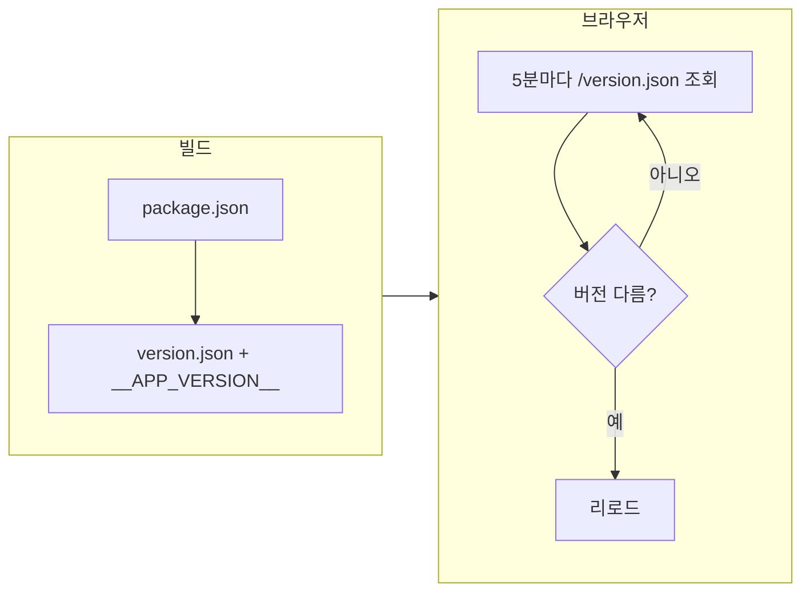

# 버전 체크 및 배포 시 자동 업데이트

배포 후 사용자가 브라우저를 새로 고치지 않아도, 주기적으로 서버 버전과 비교하여 새 버전이 배포되면 자동으로 페이지를 리로드하는 기능입니다.

## 개요

- **목적**: 새 버전 배포 시 사용 중인 탭이 이전 번들을 캐시하고 있어도, 일정 주기로 서버의 버전을 확인해 다르면 리로드하여 최신 버전을 적용
- **동작**: 5분마다 `/version.json`을 fetch하여 현재 앱에 주입된 `__APP_VERSION__`과 비교, 다르면 `window.location.reload()` 호출
- **관련 코드**: `App.tsx`의 `AppContent`에서 `useVersionCheck()` 호출 (공용 패키지 `@repo/feature/hooks`), 빌드 시 `vite.config.ts`의 버전 파일 생성

## 전체 플로우



## 빌드 시 동작

| 단계 | 위치 | 설명 |
|------|------|------|
| 1 | `package.json` | `version` 필드가 단일 소스 |
| 2 | `vite.config.ts` | `generateVersionJson(pkg.version)` 플러그인으로 빌드 결과물에 `version.json` 생성 |
| 3 | `vite.config.ts` | `define: { __APP_VERSION__: JSON.stringify(pkg.version) }`로 런타임에 주입 |

### version.json 생성 (vite.config.ts)

```ts
function generateVersionJson(version: string): Plugin {
  return {
    name: 'generate-version-json',
    generateBundle() {
      this.emitFile({
        type: 'asset',
        fileName: 'version.json',
        source: JSON.stringify({ version }),
      });
    },
  };
}
```

- 빌드 시 `dist/version.json`이 생성되며, 배포 시 이 파일이 서버 루트(또는 SPA 기준 `/version.json`)로 제공되어야 합니다.

## 런타임 동작 (useVersionCheck)

- **구현**: `packages/feature/src/hooks/useVersionCheck.ts`
- **주기**: `VERSION_CHECK_INTERVAL = 5 * 60 * 1000` (5분)
- **비교**: 서버의 `version.json.version` vs 번들에 주입된 `__APP_VERSION__`
- **호출 위치**: `App.tsx` → `AppContent` 내부 (디바이스 스토어 hydration 이후 마운트되는 컴포넌트에서 호출)

## 요약

- **버전 소스**: `package.json` → 빌드 시 `version.json` 파일 + `__APP_VERSION__` 상수
- **체크**: 5분마다 `/version.json` fetch → 버전 불일치 시 리로드
- **목적**: 배포 후에도 열려 있는 탭이 일정 시간 내에 최신 버전으로 자동 갱신되도록 함
